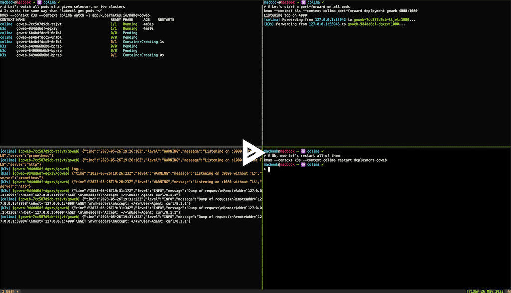

# kmux

[](https://github.com/ViBiOh/kmux/actions)

`kmux` is a tool for executing common Kubernetes actions on one or many clusters at the same time.

For example when you have multiple Kubernetes clusters you want to tail the logs of the same deployment simultaneously, or check the image deployed on each cluster.

[](https://asciinema.org/a/vdYLDWGB7X3v5H5DW9ccnRkg1)

## Getting started

### Release

Download the latest binary for your os and architecture from the [GitHub Releases page](https://github.com/ViBiOh/kmux/releases)

```bash
curl \
  --disable \
  --silent \
  --show-error \
  --location \
  --max-time 300 \
  "https://github.com/ViBiOh/kmux/releases/latest/download/kmux_$(uname -s | tr "[:upper:]" "[:lower:]")_$(uname -m | tr "[:upper:]" "[:lower:]" | sed "s|aarch64|arm64|").tar.gz" | tar -xz "kmux"
mv "kmux" "/usr/local/bin/kmux"
```

### Golang

```bash
go install "github.com/ViBiOh/kmux@latest"
```

### Shell completions

Shell completions are available by running the following command (example is for `bash`, but it's available for `zsh`, `fish` and `powershell`).

```bash
source <(kmux completion bash)
```

You can also put in a dedicated file and source it from your `*sh.rc`

## Features

Because the goal of this tool is to be used on multiple clusters at once, we rely on high-level object name (object that templatize pods, e.g. deployments, daemonset, etc.).

For running on multiple clusters at once, set the `--context` flag multiple times.

```bash
kmux --context central1 --context europe1 --context asia1 image
```

```
Global Flags:
  -A, --all-namespaces      Find resources in all namespaces
      --context strings     Kubernetes context, multiple for mutiplexing commands
      --kubeconfig string   Kubernetes configuration file (default "${HOME}/.kube/config")
  -n, --namespace string    Override kubernetes namespace in context
```

### `log`

`log` command open a pod's watcher on a resource (Deployment, Service, CronJob, etc) by using label or fiels selector and stream every container's logs of every pod it finds. New pods matching the selector are automatically streamed. Logs are stream by default (the `--follow` option in regular `kubectl`).

Each log line has a prefix of the pod's name and the container name, and also the context's name if there are multiple contexts. These kind of metadatas are written to the `stderr`, this way, if you have logs in JSON, you can pipe `kmux` output into `jq` for example for extracting wanted data from logs (instead of using `--grep` or native `grep`). You can also remove completely the prefixes by setting `--raw-output` option.

If your logs are in JSON, you can also filter output based on their color:

- 🟥 `red`: HTTP/5xx or `ERROR`, `CRITICAL` or `FATAL` level (case insensitive)
- 🟨 `yellow`: HTTP/4xx or `WARN[ING]` level (case insensitive)
- ⬜️ `white`: Regular log (or unidentified)
- 🟩 `green`: HTTP/3xx or `DEBUG`, `TRACE` level (case insensitive)

Log levels and HTTP Status codes are determined by searching for keys defined in options `--statusCodeKeys` and `--levelKeys`. The most common values are defined by default. First match of level or http status code determine the color.

The `--container` can be set to restrict output to the given containers' name.

```bash
Get logs of a given resource

Usage:
  kmux log TYPE NAME [flags]

Aliases:
  log, logs

Flags:
  -c, --container string          Filter container's name by regexp, default to all containers
  -d, --dry-run                   Dry-run, print only pods
  -g, --grep strings              Regexp to filter log
      --grepColor string          Get logs only above given color (red > yellow > green)
  -v, --invert-match              Invert regexp filter matching
      --levelKeys strings         Keys for level in JSON (default [level,severity])
      --no-follow                 Don't follow logs
  -r, --raw-output                Raw ouput, don't print context or pod prefixes
  -l, --selector stringToString   Labels to filter pods (default [])
  -s, --since duration            Display logs since given duration (default 1h0m0s)
      --statusCodeKeys strings    Keys for HTTP Status code in JSON (default [status,statusCode,response_code,http_status,OriginStatus])
```

### `port-forward`

Like `log`, `port-forward` command open a pod's watcher on a resource and port-forward to every container matching port and being ready. New pods matching the selector are automatically streamed.

A local tcp load-balancer is started on given `local port` that will forward to underlying pods by using round-robin algorithm.

```bash
Port forward to pods of a resource

Usage:
  kmux port-forward TYPE NAME [local_port:]remote_port [flags]

Aliases:
  port-forward, forward

Flags:
  -d, --dry-run      Dry-run, print only pods
  -l, --limit uint   Limit forward to only n pods
```

### `watch`

`watch` for all pods in a given namespace (or all namespaces). Status phase is done in a nearly same way that the official `kubectl` (computing the status of a Pod is not that easy).

Output is colored according to the current status of the pod, for better clarity.

```bash
Get all pods in the namespace

Usage:
  kmux watch [flags]

Flags:
  -L, --label-columns strings     Labels that are going to be presented as columns
  -o, --output string             Output format. One of: (wide)
  -l, --selector stringToString   Labels to filter pods (default [])
      --show-annotations          Show all annotations as the last column (after labels if both asked)
      --show-labels               Show all labels as the last column
```

### `restart`

`restart` performs the equivalent of a rollout restart on given resource (add an annotation of the pod spec). For `job`, it's the equivalent of a replacement (delete then create).

```bash
Restart the given resource

Usage:
  kmux restart TYPE NAME [flags]

Flags:
  -u, --user string   User added in the restartedBy annotation (read from $KMUX_USER)
```

### `image`

`image` prints the image name of all containers found in given resource. The idea is to check that every cluster runs the same version.

```bash
Get all image names of containers for a given resource

Usage:
  kmux image TYPE NAME [flags]

Flags:
  -c, --container string   Filter container's name by regexp, default to all containers
```

### `env`

`env` prints the configured environment variables from the given resource. When a value is dynamic (e.g. `hostIP`, `podIP`, etc.), the value from the most "live" pod is retrieved.

```bash
Get all configured environment variables of containers for a given resource

Usage:
  kmux env TYPE NAME [flags]

Flags:
  -c, --container string   Filter container's name by regexp, default to all containers
```
